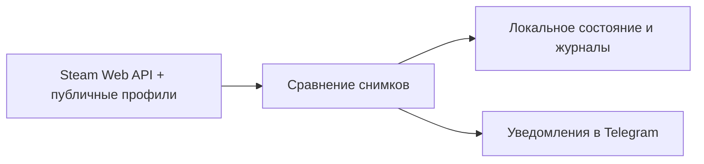

# 🎮 Steam Profile Monitor

> Монитор публичных Steam-профилей с уведомлениями в Telegram.

🌐 **Язык / Language:** [Русский](README.md) · [English](README_EN.md)


## 📌 Overview

Steam Profile Monitor периодически опрашивает Steam Web API и публичные страницы профилей, сравнивает снимки состояния и отправляет в Telegram уведомления об изменениях. Состояние и история хранятся локально.

> [!WARNING]
> Если `allowed_user_id` не задан, команды бота не ограничены одним пользователем. Настоятельно рекомендуется указать его.

## ✨ Features

- Мониторинг нескольких аккаунтов по SteamID64.
- Отслеживание профиля и активности: статус, игра, rich presence, комментарии, друзья, бейджи (каждый блок отключается в конфиге).
- Разбор CS2 status, сохранение матчей и команда `/cs2today`.
- Напоминания о длительном online/игровом статусе.
- Команды и кнопки меню в Telegram: `/status`, `/accounts`, `/cs2today`, `/steamiduk`.
- Опциональное обогащение данными SteamID.uk и синхронизация watch list.
- Локальное состояние, общий и отдельные по аккаунтам журналы.
- Опциональный HTTP/SOCKS5 proxy для Telegram API.

## 🏗️ How it works



## 🚀 Quick start

### Requirements

- Python 3.14 или новее;
- Telegram bot token от [@BotFather](https://t.me/BotFather);
- Steam Web API key со страницы <https://steamcommunity.com/dev/apikey>;
- SteamID64 публичных аккаунтов;
- Telegram-чат, группа или канал, куда бот может отправлять сообщения.

### Installation

```bash
git clone https://github.com/soroka01/Steam-Profile-Monitor.git
cd Steam-Profile-Monitor
python -m venv .venv
```

Windows PowerShell:

```powershell
.\.venv\Scripts\Activate.ps1
python -m pip install -r requirements.txt
```

Linux или macOS:

```bash
source .venv/bin/activate
python -m pip install -r requirements.txt
```

### Configuration

Windows PowerShell:

```powershell
Copy-Item config.ini.example config.ini
```

Linux или macOS:

```bash
cp config.ini.example config.ini
```

Заполните `config.ini` до запуска (см. раздел «Configuration» ниже).

### Run

```bash
python SteamProfileMonitor.py
```

На Windows можно использовать `start_monitor.bat` (или `start.bat` — они эквивалентны): скрипт создаёт локальную `.venv`, устанавливает зависимости и запускает монитор. Для автозапуска без интерактивного `pause` запускайте Python напрямую через планировщик задач или process manager.

## ⚙️ Configuration

Все настройки находятся в `config.ini`. Значения в колонке «Default» — значения по умолчанию в коде; в `config.ini.example` некоторые заданы иначе (указано в описании). Значения, начинающиеся с `YOUR_`, считаются пустыми.

### `[telegram]`

| Variable | Default | Description |
| --- | --- | --- |
| `bot_token` | — (обязательно) | Токен бота от BotFather |
| `chat_id` | — (обязательно) | Получатель автоматических уведомлений |
| `allowed_user_id` | пусто | Пользователь, которому разрешены команды; без него команды не ограничены |
| `proxy` | пусто | HTTP или SOCKS5 proxy для Telegram API, например `socks5://127.0.0.1:1080` |

### `[steam]`

| Variable | Default | Description |
| --- | --- | --- |
| `api_key` | — (обязательно) | Steam Web API key |
| `poll_interval_seconds` | `60` | Интервал проверки; минимум 10 секунд (в example: `10`) |
| `status_reminder_interval_seconds` | `3600` | Интервал напоминаний для online/game; `0` отключает |
| `persona_state_debounce_seconds` | `120` | Сколько новый persona state в online-состоянии без игры должен сохраняться перед принятием в snapshot; отдельное уведомление не отправляется |
| `notify_on_start` | `false` | Совместимый ключ; в текущей версии не меняет поведение baseline (в example: `true`) |
| `monitor_comments` | `true` | Читать последние комментарии профиля |
| `monitor_friends` | `true` | Читать список друзей |
| `monitor_badges` | `true` | Читать бейджи и их уровни |
| `monitor_rich_presence` | `true` | Читать rich presence активной игры |
| `monitor_cs2` | `true` | Разбирать CS2 status, сохранять матчи и включать `/cs2today` |

### Аккаунты

```ini
[accounts]
76561198000000001 = Main
76561198000000002 = Alt

; либо отдельными секциями:
[account:second]
steam_id = 76561198000000003
label = Another account
```

Одинаковый SteamID64, указанный несколько раз, дедуплицируется; последнее описание имеет приоритет.

### `[steamid_uk]` (опционально)

| Variable | Default | Description |
| --- | --- | --- |
| `enabled` | `false` | Включить SteamID.uk enrichment; нужны также `api_key` и `myid` |
| `api_key` | пусто | API key SteamID.uk (или переменная окружения `STEAMID_UK_API_KEY`) |
| `myid` | пусто | Ваш SteamID64 для API-запросов (или `STEAMID_UK_MYID`) |
| `refresh_interval_seconds` | `21600` | Период обновления; минимум 300 секунд |
| `sync_watchlist` | `false` | Добавлять отслеживаемые SteamID в удалённый watch list |
| `watchlist_id` | `1` | ID watch list для синхронизации |

Переменные окружения только передают credentials и сами интеграцию не включают: в `config.ini` по-прежнему нужен `enabled = true`.

> [!WARNING]
> `sync_watchlist = true` изменяет ваш watch list в SteamID.uk. Включайте его только намеренно.

### Команды Telegram

| Команда | Действие |
| --- | --- |
| `/start` | Краткая справка и меню |
| `/status` | Текущий статус и длительности по аккаунтам |
| `/accounts` | Список отслеживаемых SteamID64 |
| `/cs2today` | Завершённые матчи CS2 за текущий локальный день (доступна только при `monitor_cs2 = true`) |
| `/steamiduk` | Данные SteamID.uk; сообщает, что интеграция выключена, если credentials не настроены |

## 🗂️ Project structure

```text
steam_monitor/
├── SteamProfileMonitor.py         # точка входа (переключается на .venv, если она есть)
├── steam_monitor_app/
│   ├── bot.py                     # запуск Telegram-бота и регистрация команд
│   ├── monitor.py                 # основная логика мониторинга и сообщений
│   ├── clients.py                 # клиенты Steam и SteamID.uk
│   ├── config.py                  # загрузка config.ini
│   ├── core.py                    # константы, пути, модели данных, логгеры
│   ├── helpers.py                 # вспомогательные функции
│   └── serialization.py           # сохранение и загрузка состояния
├── config.ini.example             # шаблон конфигурации
├── requirements.txt               # зависимости
├── start.bat / start_monitor.bat  # запуск на Windows (эквивалентны)
└── LICENSE
```

Локальные данные создаются во время работы и исключены из Git:

| Файл или каталог | Содержимое |
| --- | --- |
| `config.ini` | Токены, API keys и список аккаунтов |
| `steam_monitor_state.json` | Последние snapshots, timelines, CS2 matches и SteamID.uk cache |
| `steam_profile_monitor.log` | Технический журнал и snapshots |
| `steam_profile_changes.log` | История обнаруженных изменений |
| `account_logs/` | Отдельный журнал каждого аккаунта |

## 🔒 Security & privacy

- Никогда не коммитьте `config.ini`, bot token, Steam API key или SteamID.uk credentials.
- Укажите `allowed_user_id`, особенно если у бота публичный username.
- State и logs могут раскрывать историю активности, друзей, комментарии и SteamID; не публикуйте их вместе с архивом проекта или диагностикой.
- После случайной публикации немедленно отзовите и перевыпустите затронутый token или key.
- Синхронизация SteamID.uk watch list — это внешнее изменение данных.

## ⚠️ Limitations

- Закрытые профили и отдельные приватные разделы могут выглядеть пустыми или offline.
- Монитор читает только первые 10 комментариев из ответа Steam Community.
- Rich presence зависит от клиента Steam и может появляться или исчезать с задержкой.
- Завершение CS2-матча определяется эвристически по rich presence, а не по официальной истории матчей.
- Persona-state transitions не создают отдельного push-уведомления.
- `notify_on_start` сейчас не управляет baseline: новый аккаунт получает baseline, существующий state продолжается без него.
- Тексты Telegram и журналы преимущественно русскоязычные.

## 📄 License

[MIT](LICENSE).

## 💬 Support

Можно [форкнуть репозиторий](https://github.com/soroka01/Steam-Profile-Monitor/fork) и доработать под себя. Если проект пригодился, поставьте [Star](https://github.com/soroka01/Steam-Profile-Monitor) — так я увижу, что он был кому-то полезен.

---

with love ❤️
