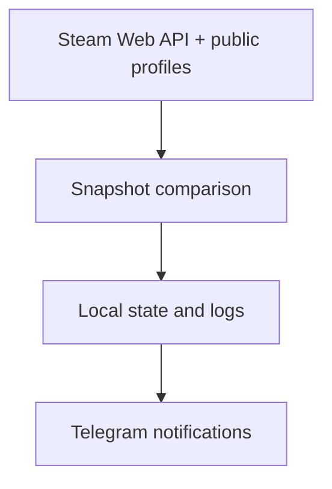

# Steam Profile Monitor

[Русский](README.md) · [English](README_EN.md)

Public Steam profile monitor with Telegram notifications. Tracks profile and activity changes, keeping state and history locally.

## Requirements

- Python 3.14 or newer;
- a Telegram bot token from [@BotFather](https://t.me/BotFather);
- a Steam Web API key from <https://steamcommunity.com/dev/apikey>;
- SteamID64 values for public accounts;
- a Telegram chat, group, or channel where the bot can send messages.

## Quick start

### 1. Clone the repository

```bash
git clone https://github.com/soroka01/Steam-Profile-Monitor.git
cd Steam-Profile-Monitor
```

### 2. Create the configuration

Windows PowerShell:

```powershell
Copy-Item config.ini.example config.ini
```

Linux or macOS:

```bash
cp config.ini.example config.ini
```

Fill in `config.ini` before starting the monitor.

### 3. Run on Windows

```bat
start_monitor.bat
```

`start.bat` and `start_monitor.bat` are currently equivalent. They create a local `.venv`, install dependencies, and start the monitor. For unattended startup without an interactive `pause`, run Python directly through Task Scheduler or another process manager.

### 4. Or run manually

```bash
python -m venv .venv
```

Windows PowerShell:

```powershell
.\.venv\Scripts\Activate.ps1
python -m pip install -r requirements.txt
python SteamProfileMonitor.py
```

Linux or macOS:

```bash
source .venv/bin/activate
python -m pip install -r requirements.txt
python SteamProfileMonitor.py
```

## How it works



## Configuration

### Telegram

```ini
[telegram]
bot_token = YOUR_TELEGRAM_BOT_TOKEN
chat_id = YOUR_TELEGRAM_CHAT_ID
allowed_user_id = YOUR_TELEGRAM_USER_ID
; proxy = socks5://127.0.0.1:1080
```

| Field | Purpose |
| --- | --- |
| `bot_token` | Bot token from BotFather |
| `chat_id` | Recipient of automatic notifications |
| `allowed_user_id` | User allowed to run commands; strongly recommended |
| `proxy` | Optional HTTP or SOCKS5 proxy for the Telegram API |

The `YOUR_TELEGRAM_USER_ID` placeholder is treated as an empty value. If `allowed_user_id` is not set, bot commands are not restricted to one user.

### Steam

```ini
[steam]
api_key = YOUR_STEAM_WEB_API_KEY
poll_interval_seconds = 10
status_reminder_interval_seconds = 3600
persona_state_debounce_seconds = 120
notify_on_start = true
monitor_comments = true
monitor_friends = true
monitor_badges = true
monitor_rich_presence = true
monitor_cs2 = true
```

| Field | Purpose |
| --- | --- |
| `api_key` | Steam Web API key |
| `poll_interval_seconds` | Polling interval; the code enforces a 10-second minimum |
| `status_reminder_interval_seconds` | Reminder interval for online/game states; `0` disables reminders |
| `persona_state_debounce_seconds` | How long a new persona state while online without a game must persist before being accepted into the snapshot; it does not send a dedicated alert |
| `notify_on_start` | Compatibility configuration key; it currently does not change baseline behavior |
| `monitor_comments` | Read recent profile comments |
| `monitor_friends` | Read the friends list |
| `monitor_badges` | Read badges and levels |
| `monitor_rich_presence` | Read active-game rich presence |
| `monitor_cs2` | Parse CS2 status, record matches, and enable `/cs2today` |

### Accounts

```ini
[accounts]
76561198000000001 = Main
76561198000000002 = Alt
```

Separate sections are also supported:

```ini
[account:second]
steam_id = 76561198000000003
label = Another account
```

Duplicate SteamID64 values are deduplicated, with the last description taking precedence.

### SteamID.uk — Optional

```ini
[steamid_uk]
enabled = false
api_key = YOUR_STEAMID_UK_API_KEY
myid = YOUR_STEAMID64
refresh_interval_seconds = 21600
sync_watchlist = false
watchlist_id = 1
```

The integration is enabled only when `enabled = true` is set in `config.ini` and both `api_key` and `myid` are available. Instead of storing the credentials in the file, you can use:

```text
STEAMID_UK_API_KEY
STEAMID_UK_MYID
```

Environment variables only supply the credentials and do not enable the integration by themselves: `config.ini` still needs `enabled = true`.

| Field | Purpose |
| --- | --- |
| `enabled` | Enable SteamID.uk enrichment |
| `api_key` | SteamID.uk API key |
| `myid` | Your SteamID64 for API requests |
| `refresh_interval_seconds` | Refresh period; minimum 300 seconds |
| `sync_watchlist` | Add monitored SteamIDs to a remote watch list |
| `watchlist_id` | Watch list ID used for synchronization |

`sync_watchlist = true` changes your SteamID.uk watch list. Enable it only intentionally.

## Telegram Commands

| Command | Action |
| --- | --- |
| `/start` | Short help and access check |
| `/status` | Current status and durations for all accounts |
| `/accounts` | List monitored SteamID64 values |
| `/cs2today` | Completed CS2 matches for the current local day |
| `/steamiduk` | Force-refresh and display the SteamID.uk report |

`/cs2today` is useful only with `monitor_cs2 = true`. `/steamiduk` reports that the integration is disabled when credentials are not configured.

## Local Data

| File or directory | Contents |
| --- | --- |
| `config.ini` | Tokens, API keys, and the account list |
| `steam_monitor_state.json` | Latest snapshots, timelines, CS2 matches, and SteamID.uk cache |
| `steam_profile_monitor.log` | Technical runtime log and snapshots |
| `steam_profile_changes.log` | Detected change history |
| `account_logs/` | A separate log for each account |

These paths are excluded from Git. Do not publish them in project archives or diagnostic reports.

## Security

- Never commit `config.ini`, bot tokens, Steam API keys, or SteamID.uk credentials.
- Set `allowed_user_id`, especially when the bot has a public username.
- State and logs may reveal activity history, friends, comments, and SteamIDs.
- Revoke and regenerate any token or key that is accidentally published.
- Remember that SteamID.uk watch-list synchronization changes remote data.

## Limitations

- Private profiles and separately hidden sections may appear empty or offline.
- The monitor reads only the first 10 comments returned by Steam Community.
- Rich presence depends on the Steam client and may appear or disappear late.
- CS2 match completion is inferred from rich presence rather than official match history.
- Persona-state transitions do not generate a dedicated push notification.
- `notify_on_start` currently does not control baselines: new accounts receive one, while existing state continues without one.
- Telegram messages and runtime logs are primarily in Russian.

## License

[MIT](LICENSE).

## Support

Feel free to [fork this repository](https://github.com/soroka01/Steam-Profile-Monitor/fork) and adapt it. If it helped you, leave a [Star](https://github.com/soroka01/Steam-Profile-Monitor) so I can see it was useful.

---

with love ❤️
