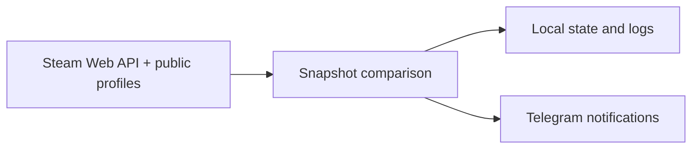

# 🎮 Steam Profile Monitor

> Public Steam profile monitor with Telegram notifications.

🌐 **Язык / Language:** [Русский](README.md) · [English](README_EN.md)


## 📌 Overview

Steam Profile Monitor periodically polls the Steam Web API and public profile pages, compares state snapshots, and sends Telegram notifications about changes. State and history are stored locally.

> [!WARNING]
> If `allowed_user_id` is not set, bot commands are not restricted to a single user. Setting it is strongly recommended.

## ✨ Features

- Monitoring of multiple accounts by SteamID64.
- Profile and activity tracking: status, game, rich presence, comments, friends, badges (each block can be disabled in the config).
- CS2 status parsing, match recording, and the `/cs2today` command.
- Reminders about long online/in-game states.
- Telegram commands and menu buttons: `/status`, `/accounts`, `/cs2today`, `/steamiduk`.
- Optional SteamID.uk enrichment and watch list synchronization.
- Local state, a general log, and per-account logs.
- Optional HTTP/SOCKS5 proxy for the Telegram API.

## 🏗️ How it works


```mermaid
flowchart LR
    A["Steam Web API + public profiles"] --> B["Snapshot comparison"]
    B --> C["Local state and logs"]
    B --> D["Telegram notifications"]
```

## 🚀 Quick start

### Requirements

- Python 3.14 or newer;
- a Telegram bot token from [@BotFather](https://t.me/BotFather);
- a Steam Web API key from <https://steamcommunity.com/dev/apikey>;
- SteamID64 values for public accounts;
- a Telegram chat, group, or channel where the bot can send messages.

### Installation

```bash
git clone https://github.com/soroka01/Steam-Profile-Monitor.git
cd Steam-Profile-Monitor
python -m venv .venv
```

Windows PowerShell:

```powershell
.\.venv\Scripts\Activate.ps1
python -m pip install -r requirements.txt
```

Linux or macOS:

```bash
source .venv/bin/activate
python -m pip install -r requirements.txt
```

### Configuration

Windows PowerShell:

```powershell
Copy-Item config.ini.example config.ini
```

Linux or macOS:

```bash
cp config.ini.example config.ini
```

Fill in `config.ini` before starting (see the "Configuration" section below).

### Run

```bash
python SteamProfileMonitor.py
```

On Windows you can use `start_monitor.bat` (or `start.bat`, which is equivalent): the script creates a local `.venv`, installs dependencies, and starts the monitor. For unattended startup without an interactive `pause`, run Python directly through Task Scheduler or another process manager.

## ⚙️ Configuration

All settings live in `config.ini`. The "Default" column shows the in-code default; `config.ini.example` sets some values differently (noted in the description). Values starting with `YOUR_` are treated as empty.

### `[telegram]`

| Variable | Default | Description |
| --- | --- | --- |
| `bot_token` | — (required) | Bot token from BotFather |
| `chat_id` | — (required) | Recipient of automatic notifications |
| `allowed_user_id` | empty | User allowed to run commands; if unset, commands are not restricted |
| `proxy` | empty | HTTP or SOCKS5 proxy for the Telegram API, e.g. `socks5://127.0.0.1:1080` |

### `[steam]`

| Variable | Default | Description |
| --- | --- | --- |
| `api_key` | — (required) | Steam Web API key |
| `poll_interval_seconds` | `60` | Polling interval; 10-second minimum (example: `10`) |
| `status_reminder_interval_seconds` | `3600` | Reminder interval for online/game states; `0` disables |
| `persona_state_debounce_seconds` | `120` | How long a new persona state while online without a game must persist before being accepted into the snapshot; no dedicated alert is sent |
| `notify_on_start` | `false` | Compatibility key; currently does not change baseline behavior (example: `true`) |
| `monitor_comments` | `true` | Read recent profile comments |
| `monitor_friends` | `true` | Read the friends list |
| `monitor_badges` | `true` | Read badges and levels |
| `monitor_rich_presence` | `true` | Read active-game rich presence |
| `monitor_cs2` | `true` | Parse CS2 status, record matches, and enable `/cs2today` |

### Accounts

```ini
[accounts]
76561198000000001 = Main
76561198000000002 = Alt

; or as separate sections:
[account:second]
steam_id = 76561198000000003
label = Another account
```

Duplicate SteamID64 values are deduplicated; the last description takes precedence.

### `[steamid_uk]` (optional)

| Variable | Default | Description |
| --- | --- | --- |
| `enabled` | `false` | Enable SteamID.uk enrichment; `api_key` and `myid` are also required |
| `api_key` | empty | SteamID.uk API key (or the `STEAMID_UK_API_KEY` environment variable) |
| `myid` | empty | Your SteamID64 for API requests (or `STEAMID_UK_MYID`) |
| `refresh_interval_seconds` | `21600` | Refresh period; minimum 300 seconds |
| `sync_watchlist` | `false` | Add monitored SteamIDs to a remote watch list |
| `watchlist_id` | `1` | Watch list ID used for synchronization |

Environment variables only supply credentials and do not enable the integration by themselves: `config.ini` still needs `enabled = true`.

> [!WARNING]
> `sync_watchlist = true` changes your SteamID.uk watch list. Enable it only intentionally.

### Telegram commands

| Command | Action |
| --- | --- |
| `/start` | Short help and menu |
| `/status` | Current status and durations for all accounts |
| `/accounts` | List monitored SteamID64 values |
| `/cs2today` | Completed CS2 matches for the current local day (available only with `monitor_cs2 = true`) |
| `/steamiduk` | SteamID.uk data; reports that the integration is disabled when credentials are not configured |

## 🗂️ Project structure

```text
steam_monitor/
├── SteamProfileMonitor.py         # entry point (switches to .venv if present)
├── steam_monitor_app/
│   ├── bot.py                     # Telegram bot startup and command registration
│   ├── monitor.py                 # main monitoring and messaging logic
│   ├── clients.py                 # Steam and SteamID.uk clients
│   ├── config.py                  # config.ini loading
│   ├── core.py                    # constants, paths, data models, loggers
│   ├── helpers.py                 # helper functions
│   └── serialization.py           # state saving and loading
├── config.ini.example             # configuration template
├── requirements.txt               # dependencies
├── start.bat / start_monitor.bat  # Windows launchers (equivalent)
└── LICENSE
```

Local data is created at runtime and excluded from Git:

| File or directory | Contents |
| --- | --- |
| `config.ini` | Tokens, API keys, and the account list |
| `steam_monitor_state.json` | Latest snapshots, timelines, CS2 matches, and SteamID.uk cache |
| `steam_profile_monitor.log` | Technical runtime log and snapshots |
| `steam_profile_changes.log` | Detected change history |
| `account_logs/` | A separate log for each account |

## 🔒 Security & privacy

- Never commit `config.ini`, bot tokens, Steam API keys, or SteamID.uk credentials.
- Set `allowed_user_id`, especially when the bot has a public username.
- State and logs may reveal activity history, friends, comments, and SteamIDs; do not publish them in project archives or diagnostic reports.
- Revoke and regenerate any token or key that is accidentally published.
- SteamID.uk watch list synchronization changes remote data.

## ⚠️ Limitations

- Private profiles and separately hidden sections may appear empty or offline.
- The monitor reads only the first 10 comments returned by Steam Community.
- Rich presence depends on the Steam client and may appear or disappear late.
- CS2 match completion is inferred from rich presence rather than official match history.
- Persona-state transitions do not generate a dedicated push notification.
- `notify_on_start` currently does not control baselines: new accounts receive one, while existing state continues without one.
- Telegram messages and runtime logs are primarily in Russian.

## 📄 License

[MIT](LICENSE).

## 💬 Support

Feel free to [fork this repository](https://github.com/soroka01/Steam-Profile-Monitor/fork) and adapt it. If it helped you, leave a [Star](https://github.com/soroka01/Steam-Profile-Monitor) so I can see it was useful.

---

with love ❤️
